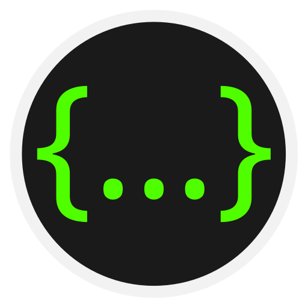
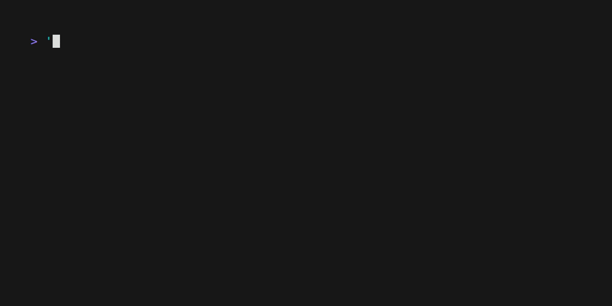

JSONLab
=======

<!-- To publish to PowerShell Gallery, commit an update to the .psd1 file -->

Cmdlets to query, transform, and update JSON data.

- [Export-Json](https://github.com/brianary/JSONLab/wiki/Export-Json): Exports a portion of a JSON document, recursively importing references.
- [Merge-Json](https://github.com/brianary/JSONLab/wiki/Merge-Json): Create a new JSON string by recursively combining the properties of JSON strings.
- [Resolve-JsonPointer](https://github.com/brianary/JSONLab/wiki/Resolve-JsonPointer): Returns matching JSON Pointer paths, given a JSON Pointer path with wildcards.
- [Select-Json](https://github.com/brianary/JSONLab/wiki/Select-Json): Returns a value from a JSON string or file.
- [Set-Json](https://github.com/brianary/JSONLab/wiki/Set-Json): Sets a property in a JSON string or file.
